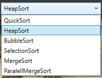
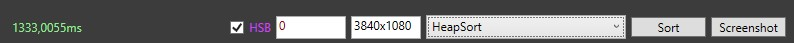
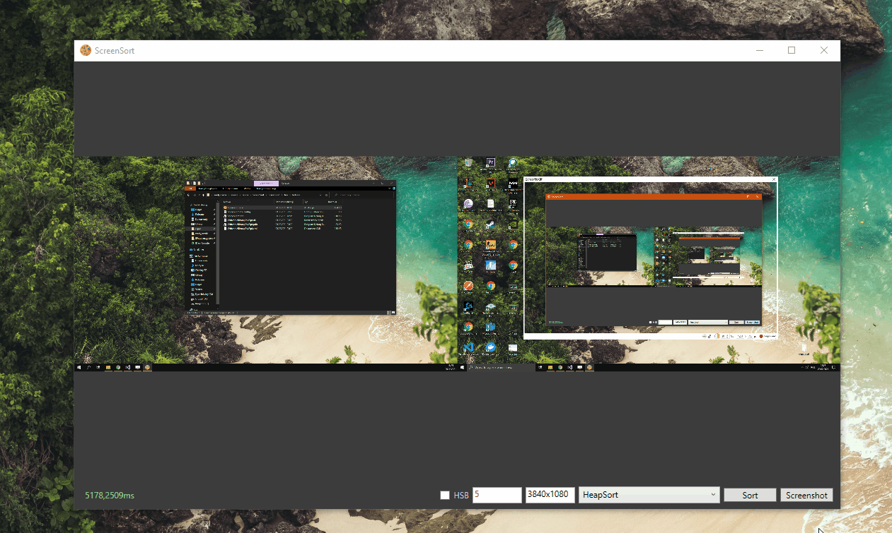

# ScreenSort
Simple WinForms app to sort pixels on screen

## Sorting algorithms
The app allows user to chose one of implemented sorting algorithms:
- QuickSort
- HeapSort
- BubbleSort
- SelectionSort
- MergeSort
- ParalellMergeSort
  

  

## Sorting/image options
In order to better demonstrate process of sorting the app enables user to slow it down by entering delay time placed differently in every algorithm (ms).
Text on the left informs about current sorting status as well as displays total time required to sort the pixel array.
  
By default pixels are compared by weighted sym of RGB values. HSB checkbox enables sorting by Hue, Saturation and Brightness.
  
The app interface allows user to choose desired image resolution and take a screenshot of screen (including the app window).
User can draw single colored lines by moving the mouse while pressing left mouse key as well as create a random image by pressing a button in right mouse button menu.

  
## External libraries

SreenSort uses **WriteableBitmapEx** (https://github.com/reneschulte/WriteableBitmapEx) library,
in particular the `WritableBitmap.ToByteArray()` extension method to easily create byte array from WritableBitmap object.
